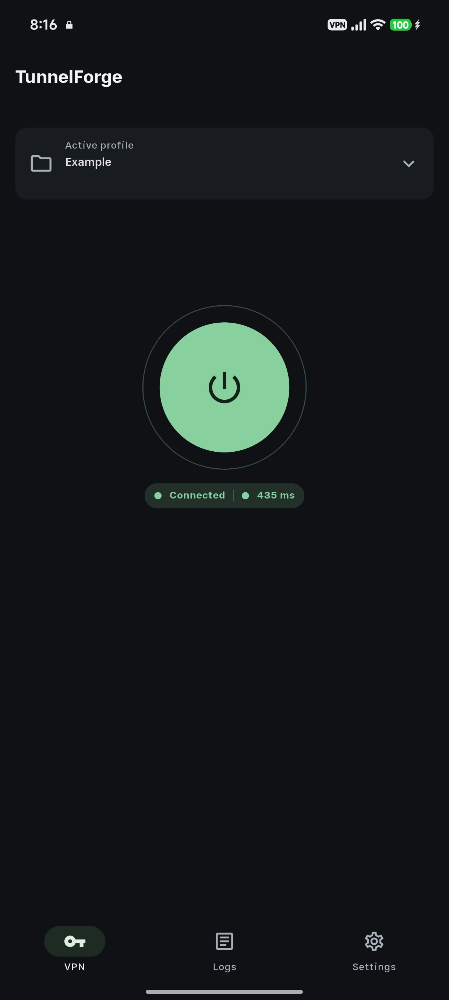
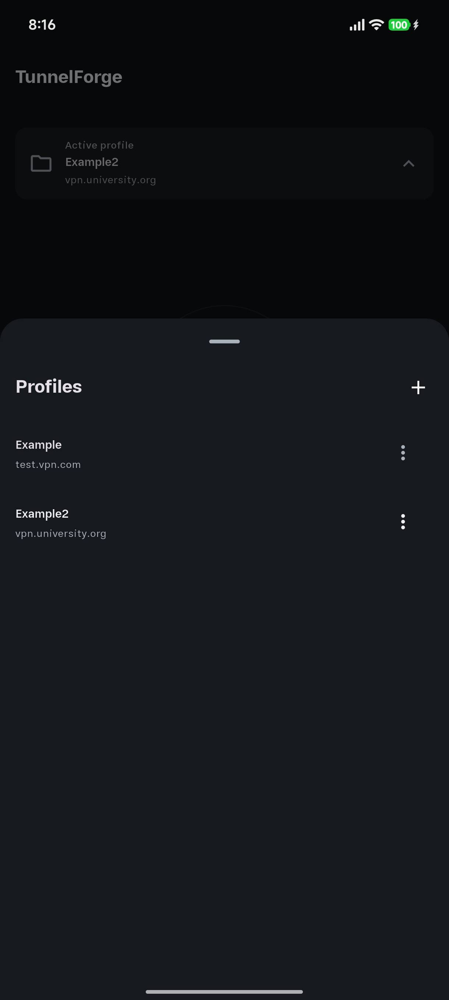
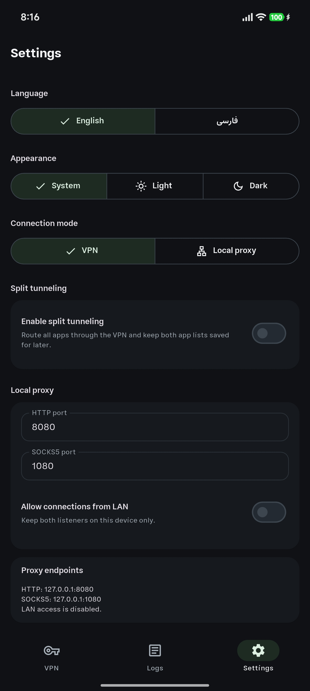

<p align="center">
  
</p>

<h1 align="center">TunnelForge</h1>

<p align="center">
  Flutter app for Android L2TP/IPsec (IKEv1), with VPN tunnel mode, proxy-only mode,
  and per-app routing.
</p>

<p align="center">
  <a href="https://github.com/evokelektrique/tunnel-forge/actions/workflows/ci.yml" style="text-decoration: none;">
    
  </a>
  <a href="https://codecov.io/github/evokelektrique/tunnel-forge" style="text-decoration: none;">
    
  </a>
  <a href="https://github.com/evokelektrique/tunnel-forge/actions/workflows/codeql.yml" style="text-decoration: none;">
    
  </a>
  <a href="https://github.com/evokelektrique/tunnel-forge/releases/latest" style="text-decoration: none;">
    
  </a>
  <a href="https://github.com/evokelektrique/tunnel-forge/releases" style="text-decoration: none;">
    
  </a>
  <a href="https://github.com/evokelektrique/tunnel-forge/blob/main/LICENSE" style="text-decoration: none;">
    
  </a>
</p>

<p align="center">
  <a href="#overview">Overview</a> •
  <a href="#screenshots">Screenshots</a> •
  <a href="#install">Install</a> •
  <a href="#development">Development</a> •
  <a href="#architecture--project-layout">Architecture</a> •
  <a href="#security--privacy">Security</a> •
  <a href="#debugging">Debugging</a> •
  <a href="#feedback">Feedback</a> •
  <a href="#licensing">Licensing</a>
</p>

## Overview

Android 12 removed the old built-in L2TP and PPTP VPN options. A lot of offices, schools, universities, and private networks still have L2TP/IPsec servers in place.

TunnelForge is an Android client for those setups. It connects to existing L2TP/IPsec (IKEv1) servers, so you can keep using the server you already have while running a current Android version.

### Key features

- L2TP with optional IPsec (IKEv1) client flow
- Full-device VPN mode
- Proxy-only mode with local HTTP and SOCKS5 listeners
- Per-app routing (Inclusive and Exclusive)
- Multiple profiles with credential storage
- Connection status and detailed logs
- Custom DNS supporting UDP, TCP, TLS and HTTPS
- Variable MTU

## Screenshots

<table>
  <tr>
    <td align="center" width="33%">
      
    </td>
    <td align="center" width="33%">
      
    </td>
    <td align="center" width="33%">
      
    </td>
  </tr>
</table>

## Install

Download the APK from [GitHub Releases](https://github.com/evokelektrique/tunnel-forge/releases/latest). TunnelForge is only the client; you still need access to a compatible L2TP/IPsec server.

## Development

### Requirements

- Flutter with Dart `3.11+`
- Go `1.25.9+` for the Android gVisor userspace networking module
- Android SDK configured for Flutter Android builds
- Android NDK and CMake, installed through Android Studio or `sdkmanager`
- Android `minSdk 31` or newer for the app target

### Setup

```sh
flutter pub get
cd android/gvisor
go mod download
cd ../..
```

Run the app on a connected Android device or emulator:

```sh
flutter run
```

### Common Workflows

The Makefile wraps the commands used during normal development:

```sh
make format
make check
make test
make build-debug
```

- `make format` formats Dart and Android native C sources.
- `make check` runs Flutter analysis, Android lint, and native C checks.
- `make test` runs Flutter, Android unit, and native C tests.
- `make build-debug` builds the Android debug APK.

For focused targets, run:

```sh
make help
```

### Coverage

```sh
flutter test --coverage
```

### Local VPN Server

The included [docker-compose.yml](docker-compose.yml) starts a local
`hwdsl2/ipsec-vpn-server` setup for Linux hosts.

1. Copy [.env.example](.env.example) to `.env`.
2. Set `VPN_PUBLIC_IP` to the address your Android client can reach.
3. Configure `VPN_IPSEC_PSK`, `VPN_USER`, and `VPN_PASSWORD`.
4. Create a matching profile in the app.

Start the server:

```sh
docker compose up -d
```

The VPN container reads only the `VPN_*` values from the root `.env`.

## Architecture & Project Layout

TunnelForge is a Flutter app at the UI layer, but the VPN runtime is mostly Android-native. Flutter keeps the profile, settings, logs, and connection state, then talks to Kotlin through platform channels. Kotlin owns the Android `VpnService` and foreground service lifecycle, runs the Netty-based HTTP CONNECT/SOCKS5 proxy frontend, and hands tunnel work to native code. The C layer handles L2TP/IPsec and packet processing; proxy-only mode also uses a small Go/gVisor userspace networking module, built as a native shared library and loaded by the Android runtime.

Netty is the local proxy frontend. It accepts HTTP CONNECT and SOCKS5 clients with event-loop based I/O, while blocking tunnel transport work stays behind that frontend. The C engine remains the core L2TP/IPsec path, and Go/gVisor provides the userspace TCP/IP stack used by proxy-only mode.

| Path | Purpose |
| --- | --- |
| `lib/` | Flutter UI, profiles, settings, logs, and app state |
| `android/app/src/main/kotlin/` | Android VPN service, Netty proxy runtime, and platform channels |
| `android/app/src/main/cpp/` | Native L2TP/IPsec tunnel engine and packet handling |
| `android/gvisor/` | Go/gVisor userspace networking used by proxy mode |
| `fastlane/metadata/` | Store metadata, screenshots, and changelogs |
| `tool/` | Release, versioning, and VPN diagnostic scripts |

## Security & Privacy

- VPN credentials are stored on-device with `flutter_secure_storage`.
- Debug logs stay local, and sensitive tokens are redacted before display or sharing.
- No analytics or crash-reporting SDKs are included in this repo.
- Review debug logs before sharing them in public issues.

## Debugging

General diagnostics:

```sh
sh tool/vpn_debug.sh check
sh tool/vpn_debug.sh diag --iface wlo1 --client-ip 192.168.1.100
sh tool/vpn_debug.sh capture --iface wlo1
sh tool/vpn_debug.sh log --iface wlo1
```

Libreswan and container logs:

```sh
sh tool/vpn_debug.sh pluto-logs --container ipsec-vpn-server
docker exec -it ipsec-vpn-server tail -f /var/log/auth.log
```

## Feedback

Use GitHub Issues or [Telegram channel](https://t.me/TunnelForge) for bugs, feature requests or general feedback. When reporting a connection problem,
include the values used in the profile (such as MTU and DNS), Android version, device model, and app logs (debug).

## Licensing

This project is licensed under `GPL-3.0-only`. See [LICENSE](LICENSE).
